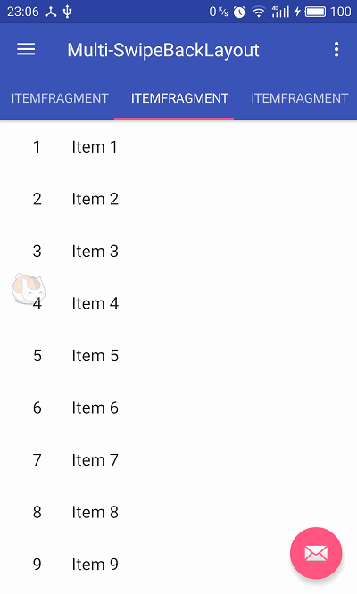

# Multi-SwipeBackLayout
多方向支持SwipeBackLayout

## 更新
**_2017-2-28_**
 * 【BUG】Activity无法返回BUG >>提交及解决

**_2017-2-26_**
 * 对ViewPager中多种View，如ScrollView、非滚动视图做了适配
 * 使用说明
 * 配置依赖，发布到JitPack

## download
    allprojects {
		repositories {
			...
			maven { url 'https://jitpack.io' }
		}
	}
    -----------------------------------------------------------
    dependencies {
	        compile 'com.github.zhouphenix:Multi-SwipeBackLayout:1.0.2'
	}
## exclude
    compile 'com.android.support:recyclerview-v7:25.2.0'

## 使用
**step1** 主题style.xml中配置一下属性

    <item name="android:windowIsTranslucent">true</item>
    <item name="android:windowBackground">@android:color/transparent</item>
**step2** 布局相应位置节点设置背景色属性， 如： android:background="@android:color/white"

**step3** 如下例子中的代码，或者你可以通过xml配置使用

        <lib.phenix.com.views.SwipeBackLayout
            app:contentView="@layout/..."//主布局也可以直接加在节点内
            app:shadowColor="@color| #ffffff"
            app:dragDirection="left|up|right|down"
            ...
            >
            <!--主布局, 优先级弱于设置属性-->
            ...
        </lib.phenix.com.views.SwipeBackLayout>

## 例子

    public abstract class BaseActivity extends AppCompatActivity {

        @Override
        public void setContentView(@LayoutRes int layoutResID) {
            View contentView = getLayoutInflater().inflate(layoutResID, null, false);
            this.setContentView(contentView);
        }

        @Override
        public void setContentView(View view) {
            SwipeBackLayout swipeBackLayout = new SwipeBackLayout(this, view, SwipeBackLayout.UP | SwipeBackLayout.LEFT | SwipeBackLayout.RIGHT | SwipeBackLayout.DOWN);
            swipeBackLayout.setOnSwipeBackListener(new SwipeBackLayout.OnSwipeBackListener() {
                @Override
                public boolean onIntercept(@SwipeBackLayout.DragDirection int direction, float x, float y) {
                    return onSwipeBackPre(direction, x, y);
                }

                @Override
                public void onViewPositionChanged(float fraction) {
                }

                @Override
                public void onAnimationEnd() {
                    finish();
                    overridePendingTransition(0, android.R.anim.fade_out);
                }
            });
            super.setContentView(swipeBackLayout);
        }
        //在有左边抽屉的界面有拦截实现
        public boolean onSwipeBackPre(@SwipeBackLayout.DragDirection int direction, float x, float y){
            return false;
        }

不多说，直接上图

## License
 Copyright 2017 zhouphenix

   Licensed under the Apache License, Version 2.0 (the "License");
   you may not use this file except in compliance with the License.
   You may obtain a copy of the License at

       http://www.apache.org/licenses/LICENSE-2.0

   Unless required by applicable law or agreed to in writing, software
   distributed under the License is distributed on an "AS IS" BASIS,
   WITHOUT WARRANTIES OR CONDITIONS OF ANY KIND, either express or implied.
   See the License for the specific language governing permissions and
   limitations under the License.