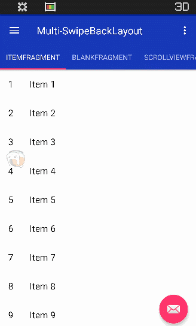

# Multi-SwipeBackLayout
多方向支持SwipeBackLayout

## 更新

**_2017-2-26_**
 * 对ViewPager中多种View，如ScrollView、非滚动视图做了适配
 * 使用说明

## 使用

## 例子

    public abstract class BaseActivity extends AppCompatActivity {

        @Override
        public void setContentView(@LayoutRes int layoutResID) {
            View contentView = getLayoutInflater().inflate(layoutResID, null, false);
            this.setContentView(contentView);
        }

        @Override
        public void setContentView(View view) {
            SwipeBackLayout swipeBackLayout = new SwipeBackLayout(this, view, SwipeBackLayout.UP | SwipeBackLayout.LEFT | SwipeBackLayout.RIGHT | SwipeBackLayout.DOWN);
            swipeBackLayout.setOnSwipeBackListener(new SwipeBackLayout.OnSwipeBackListener() {
                @Override
                public boolean onIntercept(@SwipeBackLayout.DragDirection int direction, float x, float y) {
                    return onSwipeBackPre(direction, x, y);
                }

                @Override
                public void onViewPositionChanged(float fraction) {
                }

                @Override
                public void onAnimationEnd() {
                    finish();
                    overridePendingTransition(0, android.R.anim.fade_out);
                }
            });
            super.setContentView(swipeBackLayout);
        }
        //在有左边抽屉的界面有拦截实现
        public boolean onSwipeBackPre(@SwipeBackLayout.DragDirection int direction, float x, float y){
            return false;
        }

不多说，直接上图

